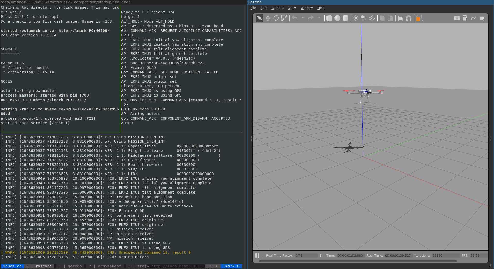
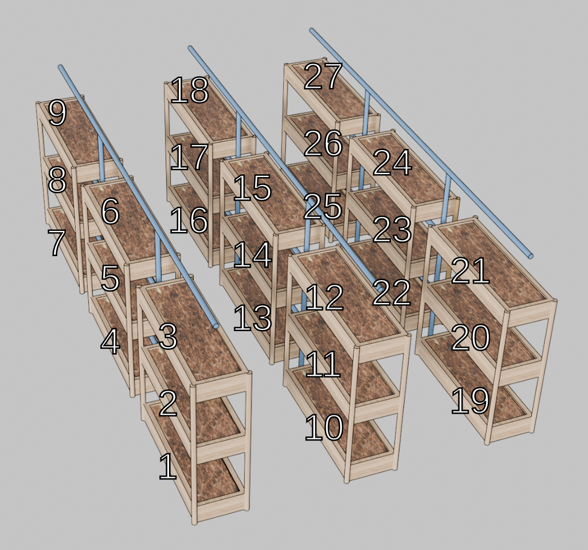
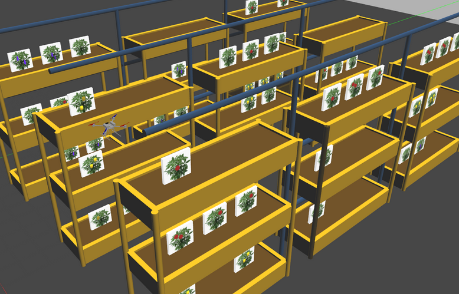

# ICUAS 2024 UAV Competition
The main repository for ICUAS'24 UAV competition for submission by ariitk

## Rulebook
Check the [rulebook](rulebook/ICUAS24_UAV_Comp_Rulebook_V1.pdf).

## Running on Docker

#### Installing Docker
Check the official docker engine installation [guide](https://docs.docker.com/engine/install/)

#### Building and Running Docker Image
  Run the following commands in order
  - ```
    ./docker_build.sh --build-args "--no-cache --pull" --focal-nogpu
    ```
  
    `--no-cache` will ensure that you do not store any cache for any of the docker commands executed other than cached images, hence everytime you rebuild using this command your current working directory (i.e. the package with the latest changes on local) will be copied onto the docker container


    Alternative Command:
    ``` 
    ./docker_build.sh --build-args "--pull --build-arg CACHEBUST=0" --focal-nogpu
    ``` 
    `CACHEBUST` when set to 0 would ensure all the docker commands are run from cache until the value of the argument remains same. In our case, I have modified the Dockerfile for this argument changes right at the command where we don't want data from the cache to be used. This saves some bit of time by skipping system wide installations (once they are atleast run once).
  
  - ```
    ./docker_run.sh --run-args "--rm" --focal-nogpu
    ```
  
    `--rm` will ensure that the docker container is always stopped and removed, whenever you all instances of the container have been closed

#### Removing cached Docker data
  If you had run docker without the `--no-cache` flag, you would have a cached copy of the package. So, any local changes in the workspace will not be reflected on docker no matter how many times you stop/rerun the container. To circumvent around this, you need to remove the cached docker images and files completely and, then use the above two commands for your workflow.
  ```
  docker system prune --all
  ```
## Current Progress

### Intermediate Submission
- [x] Implemented working refactored solution for intermediate submission with seperate window via trajectory publisher
- [X] Testing intermediate submission (from scratch) on bare minimum sandbox
- [X] Submitting the .zip file for intermediate submissions after cross-checking for human erros and testing
- [X] Takeoff Service Conflicting with waypoint follower -> increase delay in the call of the trajectory planner
- [x] Implemented working refactored solution for intermediate submission with seperate window via trajectory publisher
- [X] Testing intermediate submission (from scratch) on bare minimum sandbox
- [X] Submitting the .zip file for intermediate submissions after cross-checking for human erros and testing

### Detection / Image Processing
- [X] Hardcoded trajectory so that the drone traverses facing each of the shelves atleast once
- [X] Enabling detection, and counting the fruits using camera feed while drone traverses the hardcoded trajectory; count fruits ignoring double counting
- [X] Implementing feed stabilizer using quaternion data from pose
- [X] A simple detection function to count the fruits given a centered pic of the fruits (taking into account the variety observed)
- [ ] Enabling detection, and counting the fruits using camera feed while drone traverses the hardcoded trajectory; count fruits ignoring double counting
- [ ] Handling cases of double counting of fruits due to single-sided and double-sided visibility

## Simulation

|  | 
|:--:| 
| UAV simulation template startup. Tmux session is running on the left side, with the Gazebo client positioned on the right. |

### Controlling the UAV

For your reference, we have set up trajectory planning using TOPP-RA, which you can use by publishing two topics:

* ```tracker/input_pose``` - Send a waypoint (PoseStamped) to TOPP-RA. TOPP-RA then interpolates trajectory between the current UAV pose and the target waypoint and sends trajectory points (MultiDOFJointTrajectoryPoint) to topic ```position_hold/trajectory``` with a given rate. The position controller of the UAV receives the trajectory point as a reference and commands the motors. 
* ```tracker/input_trajectory``` - Generate a trajectory using the given sampled path in the form of waypoints (MultiDOFJointTrajectory). TOPP-RA then interpolates trajectory from the current UAV pose to the first point of the trajectory and interpolates trajectory between sampled path points. Once the trajectory is interpolated, each trajectory point is sent as a reference to the position controller via the ```position_hold/trajectory``` topic

To control the UAV directly, and to publish the trajectory that you generated via your solution, you need to use the following topic:
* ```position_hold/trajectory``` - Publish a trajectory point directly to the UAV position control

Current position reference (the last one sent to the position controller of the UAV) can be obtained via ```carrot/pose``` topic, while the current pose of the UAV (in simulation) is available at ```odometry``` topic.

### Configuration

Configuration files are placed in the ```startup/challenge/custom_config``` folder.

* [Position Control](startup/challenge/custom_config/position_control_custom.yaml)
* [TOPP Trajectory Generation](startup/challenge/custom_config/topp_config_custom.yaml)


### Plant beds, plants, and fruits

The goal of the UAV is to count the total number of fruits of a given plant. The list of beds that the UAV needs to visit will be provided on the topic ```plant_beds``` within the UAV namespace. The message is a string (```std_msgs/String```) and contains the name of the plant and beds that need to be visited (eg. ```Pepper 1 2 8 12 19```), separated by whitespace. The number of beds may vary in a given mission. 

|  | 
|:--:| 
| Plant beds layout. |

Plants are simulated via textures on flat surfaces. The fruits of one variety of plants have the same color and shape and are simulated as 3D objects partially visible from either one or both sides of the plant. The shapes and colors of fruits on different variety of plants are different. There are three plant varieties: a) Tomato (red), b) Pepper (yellow), and c) Eggplant (purple). 

## Challenge

More details on the challenge can be found in the competition rulebook. After the UAV and the world is spawned, plants will also be spawned in beds. One plant bed can contain up to three plants. Each plant may have a different number of fruits (including zero). Some plant beds in the world may be empty, but the ones listed in the mission specification through the ```plants_beds``` topic will have at least one plant. 

|  | 
|:--:| 
| UAV in the simulation arena for the ICUAS 2024 challenge. |

The setup in this repo reflects how the world for evaluation will be constructed. Teams are welcome to make a permanent world for testing and development since spawning of a large number of plants in Gazebo takes some time. 


### Important node for running your code
Remember that you should run your code alongside the existing setup through the session file. Use the existing solution section. You can use either existing waits to spawn your nodes or set your nodes to listen to the following topic:

* ```challenge_started``` - After ```True``` is published on this topic the UAV is set up correctly.
* ```plant_beds``` - After the array of points of interest is published on this topic the arena is set up correctly.

Make sure to wait for data on both topics to safely run your code.

### Changing the plant locations for testing
You can change plant locations through the session file or spawn them from a separate terminal. Use position args to change the location of the plant. 

### Sign convention used and Distances between beds 

Green: Y Axis 
Red: X Axis 

* Gap between shelf: 6.00 ; Range(4.00, 16.00)
* Gap between shelf: 1.50 ; Range(4.5, 22.5)
* Gap between z levels : 2.80 ; Range(1.1, 6.99999999999999) 
